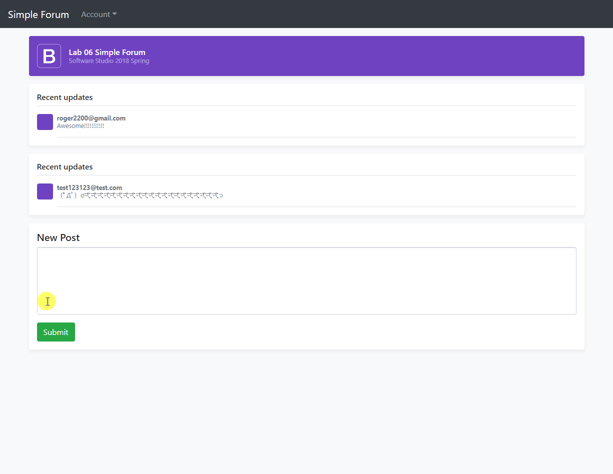

# Lab06 - Simple Forum

A Firebase-backed forum exercise with sign-up, sign-in, posting, and real-time message updates. The interface is a static Bootstrap site designed for deployment with Firebase Hosting.

## Intended features

- Email/password registration and login
- Google sign-in
- Authenticated logout
- Create posts in Firebase Realtime Database
- Display existing and newly added posts in real time
- Restrict database reads and writes to signed-in users
- Deploy the site through Firebase Hosting

## Technology

- HTML, CSS, JavaScript, and Bootstrap
- Firebase Authentication
- Firebase Realtime Database
- Firebase Hosting

## Run locally

1. Create a Firebase project and enable Authentication and Realtime Database.
2. Add the Firebase web configuration to `public/js/config.js`.
3. Complete the remaining TODO sections in the authentication, posting, and database-rule files.
4. Serve the `public` directory locally or deploy it with the Firebase CLI.

## Status

The repository contains the full starter interface and deployment configuration, but the Firebase configuration and several core TODOs are not completed yet.
